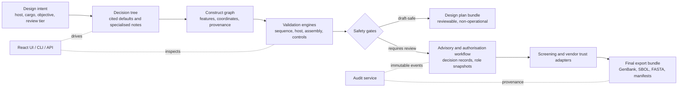

# Cloning & Expression Vector Design Toolkit

A local-first research software platform for designing, validating, reviewing, and exporting cloning and expression vector designs under explicit scientific, safety, provenance, and audit controls.

The project is built for the space between molecular design intent and release-ready digital artefacts: it captures biological objectives, constructs a standards-oriented vector model, runs compatibility and safety gates, records advisory decisions, and exports traceable design bundles. It does **not** replace institutional biosafety review, synthesis-vendor screening, or professional scientific judgement.

- **Owner:** General Molecular Expression Service Pty Ltd (GMExpression, GMES)
- **Current release:** `v0.1.0`
- **Implementation status:** Phase 0 through Phase 13 complete locally; UI/risk-gate documentation refreshed after release.
- **License:** GPL-3.0-only
- **Primary audience:** molecular-biology software developers, scientific reviewers, platform architects, and institutional governance teams.

---

## System At A Glance



The platform is deliberately gate-first. A design can be explored and reviewed before it becomes operationally actionable, and final export remains blocked until validation, screening, and authorisation conditions are satisfied.

## What The Toolkit Does

- Captures design intent through a decision tree with cited defaults, specialised notes, and lockable modules.
- Represents vector designs as typed, coordinate-aware construct graphs rather than loose sequence strings.
- Checks host, origin, marker, expression cassette, cargo/tag, assembly, and biosafety compatibility.
- Separates draft design planning from gated operational SOP-linked protocol rendering.
- Routes advisory cases through signed decision records, role snapshots, review queues, and audit trails.
- Supports standards-oriented import/export paths including GenBank, SBOL 3, FASTA, EMBL/GFF3, and SnapGene integration paths.
- Provides a React + TypeScript workspace with construct maps, compatibility matrix, validation report, review actions, and export readiness surfaces.
- Preserves traceability through manifests, event streams, deterministic renderers, release fixtures, and CI gates.

## What It Does Not Do

- It does not authorise wet-lab work.
- It does not bypass institutional biosafety committees, synthesis-vendor screening, or local regulations.
- It does not expose operational wet-lab instructions unless the configured authorisation gates allow the corresponding SOP-linked output.
- It does not treat LLM text as authoritative scientific evidence; LLM-assisted constraints pass through citation, policy, and review controls.

## Repository Map

| Path | Purpose |
|---|---|
| `ARCHITECTURE.md` | Binding architecture for the modular-monolith, ports, gates, event streams, persistence, and safety boundaries. |
| `REQUIREMENTS.md` | Functional, molecular-rule, workflow-rule, biosafety, vendor, and acceptance requirements. |
| `CODING_AGENDA.md` | Authoritative implementation plan and task ordering. |
| `TASK_BOARD.md` | War-room status board for phases, risk register, CI gate lifecycle, and task completion. |
| `ROADMAP.md` | Phase-level implementation record and release path. |
| `Cloning_and_Expression_Vector_Design_Knowledge_Base_v2_0.md` | Citation-bearing scientific knowledge base and rule catalogue. |
| `Cloning_Expression_Vector_Design_White_Paper.md` | Human-readable scientific narrative, examples, glossary, and teaching material. |
| `docs/` | Machine-readable manifests, release notes, platform caveats, security notes, and traceability index. |
| `src/` | Python implementation: domain model, engines, adapters, app services, CLI/API/admin surfaces. |
| `ui/` | Vite + React + TypeScript user interface. |
| `tests/` | Unit, integration, CI-gate, security, UI metadata, UAT, and release tests. |
| `tools/` | CI gates, release helpers, agenda consistency checks, and support utilities. |

## Scientific And Engineering Model

The platform follows a layered scientific-control model:

1. **Intent capture:** the user states objective, host, cargo, expression mode, cloning chemistry, tagging, and review tier.
2. **Construct modelling:** the system binds sequence, feature coordinates, provenance, and compatibility metadata into a typed graph.
3. **Validation:** engines check molecular constraints, host compatibility, sequence integrity, assembly boundaries, controls, and policy constraints.
4. **Advisory routing:** warning and blocked states become auditable review decisions rather than passive UI messages.
5. **Screening and governance:** configured screening and trust adapters participate before operational export.
6. **Export:** only permitted artefacts are generated for the current gate state, with manifests and provenance hashes.

This is the core design principle: **make unsafe or unsupported states structurally visible, traceable, and hard to export by accident.**

## User Interface

The current React workspace provides:

- a global design summary with export readiness and review state;
- a wet-lab workflow stage rail;
- import and selection surfaces for sequence, backbone, cargo, and SnapGene connection state;
- decision-tree controls with cited defaults and specialised-note capture;
- circular and linear vector maps plus a construct architecture table;
- compatibility matrix and validation report;
- advisory acknowledgement, decline, and escalation paths;
- admin queue, audit log, design diff, and GMExpression footer branding.

Run the UI locally:

```powershell
cd ui
npm install
npm run dev -- --port 5173
```

Then open:

```text
http://127.0.0.1:5173/
```

## Local Verification

The project targets Python `>=3.11.15,<3.12`. Use the repository virtual environment or another compatible Python 3.11 environment.

```powershell
$env:PYTHONPATH='src;.'
.\.venv\Scripts\python.exe tools\agenda_consistency_check.py
.\.venv\Scripts\python.exe tools\ci\run_pytest.py -m "not slow"
```

Focused UI checks:

```powershell
cd ui
npm test
npm run build
```

Optional IO tests require optional dependencies such as `sbol3`, `biopython`, and SnapGene-related packages from the `io` extra.

## Release

`v0.1.0` is the first complete local implementation line. It closes the planned Phase 0-13 scope with:

- deterministic white-paper UAT fixtures;
- adversarial UAT coverage for authorisation, audit, advisory, plugin, export, replay, and IPC boundaries;
- deterministic combinatorial-library benchmark fixtures;
- release build wrappers for wheel and container outputs;
- safety-gated export and SOP-linked protocol rendering;
- refreshed README, release notes, and workflow-grade UI documentation.

Release notes live in:

```text
docs/release/v0.1.0_release_notes.md
```

## Safety Notice

Generated outputs are advisory research artefacts. They do not constitute approval for cloning, expression, synthesis, shipment, diagnostic use, therapeutic use, environmental release, or any other regulated activity. Users remain responsible for institutional review, biosafety classification, vendor screening, material-transfer obligations, and legal compliance.

For Research Use Only.
