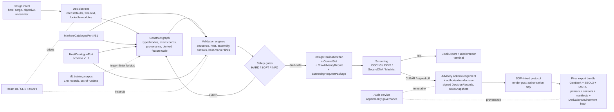

# Cloning & Expression Vector Design Toolkit

**Local-first, gate-controlled design and validation for cloning and expression vectors**

| Badge | Value |
|---|---|
| Version | `v0.2.1` (commit `7b53bf2`; v0.2.0 tag at `c5b88a8`) |
| License | GPL-3.0-only |
| Python | `>=3.11.15, <3.12` |
| Node | 20 LTS (UI build only) |
| Tests | 680 passed locally (with optional `sbol3` extras); 654 / 1 fail / 2 skip without |
| ML training corpus | 148 records across 14 categories; `partition: sa_free` default |
| CI gates | 24+ merge-blocking + lifecycle-tracked; 8 added in v0.2 / v0.2.1 |
| Active task cards | 92 across 16 phases (all done locally) |
| Canonical ports | 51 (see [`docs/port_manifest.yaml`](docs/port_manifest.yaml)) |

The Cloning & Expression Vector Design Toolkit is a research-software platform that turns molecular-design intent into release-ready digital artefacts under explicit scientific, safety, provenance, and audit controls. It captures objectives through a cited decision tree, builds typed construct graphs, runs ~128 declarative compatibility and safety rules, routes advisories through signed governance records, and emits validated GenBank / SBOL 3 / FASTA bundles. It is built for molecular-biology software developers, scientific reviewers, platform architects, and institutional governance teams who need their tooling to *make unsafe states structurally visible, traceable, and hard to export by accident*.

Owned and maintained by **General Molecular Expression Service Pty Ltd (GMExpression® / GMES)**. Licensed under GPL-3.0-only.

**Quick links:** [Architecture](ARCHITECTURE.md) · [Requirements](REQUIREMENTS.md) · [Coding Agenda](CODING_AGENDA.md) · [Task Board](TASK_BOARD.md) · [Roadmap](ROADMAP.md) · [IP Policy](IP_POLICY.md) · [Third-Party Notices](LICENSES/THIRD_PARTY_NOTICES.md) · [Fork-Readiness Memo](ARCHITECTURE.md#96-normative--fork-readiness-memorandum) · [Fork-Readiness Checklist](docs/fork-readiness/checklist.md) · [v0.1.0 Release Notes](docs/release/v0.1.0_release_notes.md) · [v0.2.0 Release Notes](docs/release/v0.2.0_release_notes.md) · [Installation](docs/release/installation.md) · [Knowledge Base v2.0](Cloning_and_Expression_Vector_Design_Knowledge_Base_v2_0.md) · [White Paper](Cloning_Expression_Vector_Design_White_Paper.md)

> **For Research Use Only.** The toolkit does **not** authorise wet-lab work, replace institutional biosafety review, or bypass synthesis-vendor screening. See [§ 11 — Intellectual property](#11-intellectual-property-patents-proprietary-methods-licensing) and the closing safety notice.

---

## Table of contents

1. [Project scope and core functionalities](#1-project-scope-and-core-functionalities)
2. [Document structure and how to navigate](#2-document-structure-and-how-to-navigate)
3. [System operating principles and architecture](#3-system-operating-principles-and-architecture)
4. [Development philosophy and design rationale](#4-development-philosophy-and-design-rationale)
5. [Usage considerations, limitations, and best practices](#5-usage-considerations-limitations-and-best-practices)
6. [Installation procedures and configuration steps](#6-installation-procedures-and-configuration-steps)
7. [System requirements and dependencies](#7-system-requirements-and-dependencies)
8. [Cloning + expression vector wet-lab fabrication pathways supported](#8-cloning--expression-vector-wet-lab-fabrication-pathways-supported)
9. [SnapGene + simulation-system collaboration model](#9-snapgene--simulation-system-collaboration-model)
10. [Concise history of major version updates and architectural milestones](#10-concise-history-of-major-version-updates-and-architectural-milestones)
11. [Intellectual property, patents, proprietary methods, licensing](#11-intellectual-property-patents-proprietary-methods-licensing)
12. [Citation and contact](#12-citation-and-contact)

---

## 1. Project scope and core functionalities

### 1.1 The problem the toolkit addresses

Between the molecular biologist's *intent* ("I want a His6-TEV–EnzymeA cassette expressed from T7 in BL21(DE3) at high yield with disulfide-bond compatibility") and a *release-ready digital artefact* (an annotated GenBank file, an SBOL 3 record, a primer set, a wet-lab-grade design plan, a fully audit-tracked decision history), there is no commodity software that **enforces** scientific correctness, safety controls, citation provenance, and governance gating at every step. Existing tools handle individual concerns — sequence layout, primer design, codon optimisation, restriction mapping, vendor submission — but they leave the integration, the safety routing, and the immutable audit trail to the user's discipline. That discipline is what this toolkit replaces with software.

The toolkit is built for the *space between intent and operational artefact*. It is hexagonal, deterministic, local-first, and ships gates as code rather than as user warnings.

### 1.2 What it does

- **Intent capture through a cited decision tree.** A step-wise wizard (`app.decision_tree`, [`app.decision_flow`](src/app/decision_flow.py)) walks the user through objective → host → cargo → expression mode → tagging → cloning chemistry → biosafety tier. Every drop-down option carries a PMID / DOI / authoritative-URL citation drawn from the source-of-truth knowledge base ([`Cloning_and_Expression_Vector_Design_Knowledge_Base_v2_0.md`](Cloning_and_Expression_Vector_Design_Knowledge_Base_v2_0.md) § 18).
- **Free-text capture for specialised constraints.** A 2 000-character free-text channel passes through a local-LLM constraint translator (`adapter.llm`) under enforced output-policy controls so unusual requirements never lose provenance.
- **Typed construct graphs.** Designs are represented as immutable, coordinate-aware `ConstructGraph` values ([`src/domain/graph`](src/domain/graph)), not loose sequence strings. The graph is the canonical model; the feature table is a derived view bound by a synchronising invariant.
- **~128 declarative rule predicates.** [`catalogues/rules/`](catalogues/rules/) ships 60 MR (molecular-genetics) + 30 WR (wet-lab workflow) + 17 SR (synthesis-vendor) + 14 BR (biosafety) + 7 MS (project-specific MS2/VLP) rules with severity classes (`HARD` / `SOFT` / `INFO`), graded citations (A1 / A2 / A3 / B1 / B2), and JSON-Schema-validated fixtures. The validation engine ([`src/engine/validation`](src/engine/validation)) consumes them through a pure-functional executor.
- **51 canonical ports.** Every external dependency — RNA folding, splice prediction, codon optimiser, screening adapter, synthesis vendor, persistence store, SnapGene channel, audit log, signing service — is a typed `Protocol` interface under [`src/domain/ports`](src/domain/ports). The full list is in [`docs/port_manifest.yaml`](docs/port_manifest.yaml) and is enforced by a port-inventory test.
- **Standards-oriented import / export.** [`adapter.io`](src/adapter/io) round-trips GenBank, FASTA, SBOL 3.1.x (sequence + exact `Range` feature coordinates), EMBL, and GFF3. Imported constructs preserve the structured `Qualifier` model (`tuple[Qualifier, ...]`, not `dict[str, str]`).
- **Gate-first pipeline with four typed safety gates.** `BlockCompile`, `BlockVendorSubmission`, `BlockExport`, and `BlockOperationalProtocol` are first-class typed states. Compile produces *no operational artefact* — only `ConstructGraph`, `ValidationReport`, `DesignRealisationPlan`, `ControlSet`, `RiskAdvisoryReport`, and a `ScreeningRequestPackage`. Operational SOP-linked output renders only after screening completes and authorisation passes.
- **Active, auditable advisory layer.** `RiskAdvisoryReport` items of severity `caution` / `strong_caution` require explicit signed acknowledgement (`RiskAdvisoryAcknowledged` governance event with ≥ 20-character justification + cryptographic signature) before any `OperationalProtocolAuthorised` event can fire. A `no-passive-advisory-bypass-check` CI gate proves the bypass is statically impossible.
- **Administrator-controlled authorisation.** The `AuthorisationProfile` minting is exclusively `AdminPrincipal | DeveloperBootstrapPrincipal`; ordinary users *declare intent* (SOP library, biosafety approval ID, operational role) which the gate then validates against the granted profile. Reviewer ⊂ Administrator in capabilities, allowing single-administrator institutions while preserving separation of duties.
- **Screening-trust-policy-controlled biosafety routing.** [`adapter.screening`](src/adapter/screening) integrates with IGSC v3, IBBIS Common Mechanism, SecureDNA, and a configurable institutional blacklist. Verdicts are typed (`CLEAR` / `WATCHLIST` / `HIT` / `UNAVAILABLE` / `NOT_APPLICABLE` / `MANUAL_REVIEW_REQUIRED`); fallbacks can produce at most `MANUAL_REVIEW_REQUIRED`; an internal blacklist never silently produces `CLEAR`.
- **ML training corpus.** [`docs/ml_corpus/`](docs/ml_corpus/) ships a 148-record curated training corpus for downstream model work — strictly *out-of-runtime* via an `import-linter` contract (`ml-corpus-is-not-runtime`). Records carry a split `sequence_license` + `annotation_license` model so factual sequence (uncopyrightable per *Feist*, *Telstra*) and curator-authored annotation (potentially copyrightable expression) are policed separately.
- **Reproducible release bundles.** Every export carries a complete `DerivationEnvironment` hash covering catalogue versions, adapter configurations, SOP-template hashes, screening-trust-policy versions, plugin package hashes, LLM prompt-template versions, institutional-policy version, and redaction policy. Determinism is verified across Linux and Windows in CI for the white-paper-example and 100-realisation library fixtures.

### 1.3 What it does NOT do

- It does **not** authorise wet-lab work. The toolkit emits design artefacts; physical execution requires institutional and biosafety approval outside the software.
- It does **not** bypass institutional biosafety committees (IBC), synthesis-vendor screening, or local regulations. Screening is a routing hook, not a substitute for the vendor's independent gate.
- It does **not** provide clinical, diagnostic, or therapeutic guidance. Outputs are advisory research artefacts, not medical devices.
- It does **not** run automated SnapGene access. **BR-16 NORMATIVE:** no pipeline this project runs may access `snapgene.com` via any non-browser tool. The [`snapgene-pipeline-scan`](tools/ci_gates/snapgene_pipeline_scan.py) CI gate is `enforced-green` from day one as a defensive default-deny.
- It does **not** certify biosafety. It routes to the configured screening adapter and records the verdict; institutions retain accountability.
- It does **not** treat LLM text as authoritative scientific evidence. LLM-assisted constraints pass through the `AdvisoryTextPolicy` and `llm-output-policy-check` controls before reaching any user-facing surface.
- It does **not** produce BSL-4 SOPs. `BiosafetyTier.BSL4` is hard-blocked at compile time with explicit `UnsupportedBiosafetyTierAttempted` audit events.
- It does **not** distribute SnapGene-authored content. Annotations, descriptions, images, and `.dna` payloads from SnapGene are never copied into the repository.

### 1.4 System at a glance



The platform is deliberately *gate-first*. A design can be explored and reviewed before it becomes operationally actionable. Final export remains blocked until validation, screening, advisory acknowledgement, and authorisation conditions are satisfied.

---

## 2. Document structure and how to navigate

The repository contains four cooperating layers: the **scientific source of truth** (KB + white paper), the **planning quartet** (requirements, architecture, coding agenda, task board), the **runtime artefacts** (`src/`, `ui/`, `catalogues/`, `schemas/`, `tools/`), and the **operational documentation** (`docs/`, `LICENSES/`, `IP_POLICY.md`). The source-of-truth hierarchy is **KB v2.0 > White Paper > v1.0 primer** — for any factual disagreement, KB v2.0 wins.

### 2.1 File-tree summary

| Path | What it is | When to read it |
|---|---|---|
| [`README.md`](README.md) | This file. | First contact; orientation. |
| [`ARCHITECTURE.md`](ARCHITECTURE.md) (~2 730 lines) | Binding architectural blueprint v1.5 + § 9 v0.2 Enrichment Amendment + § 9.6 NORMATIVE Fork-Readiness Memorandum. | Before adding any port, module, or CI gate. |
| [`REQUIREMENTS.md`](REQUIREMENTS.md) (~870 lines) | SRS v0.2: UR-01 .. UR-14, FR-* / MR-* / WR-* / SR-* / BR-* / MS-* / NFR-* / SC-* / DR-* / AC-* catalogues. | Before changing any user-facing behaviour. |
| [`CODING_AGENDA.md`](CODING_AGENDA.md) (~2 930 lines) | Authoritative implementation plan v1.5: 92 active task cards across 16 phases, model-tier-per-module assignments, parallelism strategy, traceability rules. | When picking up an implementation task. |
| [`TASK_BOARD.md`](TASK_BOARD.md) (~405 lines) | War-room dashboard: task lifecycle, six-dimension audit per phase, risk register, CI gate lifecycle states. | When tracking what is in flight or what shipped. |
| [`ROADMAP.md`](ROADMAP.md) (~607 lines) | Dependency-ordered phase view of `CODING_AGENDA.md`; regenerated from it. | When discussing phase ordering with stakeholders. |
| [`Cloning_and_Expression_Vector_Design_Knowledge_Base_v2_0.md`](Cloning_and_Expression_Vector_Design_Knowledge_Base_v2_0.md) | Citation-bearing scientific knowledge base, parts + hosts + assembly catalogues, validation rules V001–V025, source registry § 18. | When verifying scientific claims or sourcing a default. |
| [`Cloning_Expression_Vector_Design_White_Paper.md`](Cloning_Expression_Vector_Design_White_Paper.md) | Human-readable scientific narrative with three worked examples (bacterial, mammalian, plant), glossary, and pedagogical diagrams. | When learning the territory or onboarding a junior researcher. |
| [`Cloning_and_Expression_Vector_Design_Knowledge_Base_v1_0.md`](Cloning_and_Expression_Vector_Design_Knowledge_Base_v1_0.md) | Original v1.0 primer; conceptually correct but not machine-actionable. | Historical only. |
| [`IP_POLICY.md`](IP_POLICY.md) | Counsel-facing IP / ToS policy v0.2: source-tier lists, SnapGene posture, CC-BY-SA partition strategy, quarterly ToS cadence. | Before adding a new corpus source or initiating a commercial fork. |
| [`LICENSES/THIRD_PARTY_NOTICES.md`](LICENSES/THIRD_PARTY_NOTICES.md) | Canonical trademark / attribution disclaimers, incl. SnapGene® nominative-use disclaimer. | Before any public release. |
| [`LICENSE`](LICENSE) | GPL-3.0-only license text. | Once. |
| [`pyproject.toml`](pyproject.toml) | Python project + dependency manifest with extras. | Before installing or adding a dep. |
| [`uv.lock`](uv.lock) | Frozen dependency lockfile. | When reproducing a build. |
| [`.importlinter`](.importlinter) | 4 import-boundary contracts (domain / engine / sop_protected / ml-corpus-is-not-runtime). | When adding a new module. |
| [`.pre-commit-config.yaml`](.pre-commit-config.yaml) | Ruff + mypy + v0.2.1 credential-scan hook. | Before first commit. |
| [`Dockerfile`](Dockerfile) | Reproducible CI container with pinned Python 3.11.15 + uv 0.11.14 + canonical fonts. | When reproducing a CI run. |
| [`mkdocs.yml`](mkdocs.yml) | Documentation site skeleton (mkdocs-material). | When building the docs site. |
| [`src/domain/`](src/domain/) | Pure types + 51 port `Protocol`s; no outward imports. | When extending the type system. |
| [`src/engine/`](src/engine/) | Pure-functional computational core: validation, codon, overhang, assembly, primer, design plan, controls, risk classification, screening gate, export gate, SOP protocol, VLP policy. | When implementing scientific logic. |
| [`src/adapter/`](src/adapter/) | I/O implementations: biology back-ends, catalogue loaders, persistence, screening, vendor, SnapGene, IPC, LLM, security. | When integrating an external tool. |
| [`src/app/`](src/app/) | Orchestration and composition: design service, decision tree, validation orchestrator, assembly orchestrator, design plan orchestrator, screening orchestrator, advisory acknowledgement, authorisation decision, admin action handler, export orchestrator. | When wiring a use case end-to-end. |
| [`src/interface/`](src/interface/) | Surfaces: CLI (Typer), API (FastAPI + WebSocket), admin service IPC, audit service IPC, React UI metadata. | When adding a user-facing command. |
| [`ui/`](ui/) | Vite + React 18 + TypeScript workspace; vector maps, validation report, advisory dialogue, admin console, audit-log viewer. | When changing the UI. |
| [`tests/`](tests/) | Unit, integration, CI-gate, security, UI metadata, UAT, and release tests (645+ tests; 680 with optional extras). | When adding code; tests live with their module. |
| [`tools/`](tools/) | CI gates, agenda consistency check, port-manifest generator, release helpers, corpus tooling, audit-key verifier, signature verifiers. | When extending tooling. |
| [`tools/ci_gates/`](tools/ci_gates/) | 32 CI gate scripts, lifecycle-tracked. | When proposing a new merge-blocking gate. |
| [`tools/release/`](tools/release/) | Wheel + container build wrappers, release-notes renderer, corpus release gate. | At release time. |
| [`tools/corpus/`](tools/corpus/) | Corpus ingestion: GenBank → record converter, modular-element emitter, PMID verifier, partition router. | When adding a corpus record. |
| [`tools/fork_readiness/`](tools/fork_readiness/) | Fork-readiness verification script stubs (filled in at fork time per § 9.6 of `ARCHITECTURE.md`). | At commercial-fork creation. |
| [`catalogues/`](catalogues/) | YAML catalogues: `hosts.yaml` (v1.1 schema, 30+ strains), `markers.yaml` (v1.0, 23 markers across 5 classes), `parts.yaml` (160+ entries), `enzymes.yaml` (65+ entries), `enzyme_buffer_compat.yaml`, `risk_advisories.yaml`, `screening_trust_policy.yaml`, `institutional_policy.yaml`, `export_profiles.yaml`, `rules/{MR,WR,SR,BR,MS}.yaml`, `screening_profiles/`, `vendor_profiles/`, `sop_templates/`, `plugin_manifests/`. | When adding a new biological default or rule. |
| [`schemas/`](schemas/) | JSON Schemas for every catalogue family; v1.1 hosts schema and v1.0 markers schema landed in v0.2. | When changing a catalogue's shape. |
| [`fonts/`](fonts/) | Canonical Noto Sans + Mono fonts (committed; not network-downloaded) for deterministic PDF rendering. | Touched only by release builds. |
| [`docs/`](docs/) | Operational documentation, machine-readable manifests, release notes, traceability index, platform caveats. | When tracking provenance or shipping artefacts. |
| [`docs/release/`](docs/release/) | [`v0.1.0_release_notes.md`](docs/release/v0.1.0_release_notes.md), [`v0.2.0_release_notes.md`](docs/release/v0.2.0_release_notes.md), [`installation.md`](docs/release/installation.md), [`migration_from_v0.0_to_v0.1.md`](docs/release/migration_from_v0.0_to_v0.1.md). | At release time. |
| [`docs/handover/`](docs/handover/) | 11 cadence-trail documents for the v0.2 Enrichment Amendment, post-cadence backlog, and three-role collaborative audit. | When reconstructing the project's decision trail. |
| [`docs/fork-readiness/checklist.md`](docs/fork-readiness/checklist.md) | Operational mirror of `ARCHITECTURE.md` § 9.6 with verification-script contracts. | At commercial-fork creation. |
| [`docs/ml_corpus/`](docs/ml_corpus/) | 148-record ML training corpus (out-of-runtime; `import-linter` forbids `src.*` from importing). Contains [`README.md`](docs/ml_corpus/README.md), `corpus_manifest.yaml`, `exclusions.yaml`, `crosscheck_log.yaml`, `override_log.yaml`, `schemas/corpus_record.schema.json`, and `records/{backbones,elements,cc-by-sa}/`. | When training a model; never from runtime code. |
| [`docs/port_manifest.yaml`](docs/port_manifest.yaml) | Authoritative list of 51 canonical ports with category + owning task + architecture section. | When adding a port. |
| [`docs/module_manifest.yaml`](docs/module_manifest.yaml) | Manually authored module registry; cross-checked by `module-coverage-check`. | When adding a module. |
| [`docs/task_manifest.yaml`](docs/task_manifest.yaml) | Seed task-card registry; cross-checked by `agenda_consistency_check.py`. | When adding a task card. |
| [`docs/traceability_index.md`](docs/traceability_index.md) | Source-file → task → architecture → requirement → KB citation chain. | When auditing provenance. |
| [`docs/platform_caveats.md`](docs/platform_caveats.md) | Known platform-specific behaviours (Windows OneDrive, SQLite WAL, font rendering). | When CI is flaky on a specific runner. |
| [`docs/rendering_determinism.md`](docs/rendering_determinism.md) | PDF / Markdown / JSON renderer determinism guarantees. | When changing a renderer. |
| [`docs/safety_gates/`](docs/safety_gates/) | Per-gate documentation including the v1.5 advisory-presentation flow. | When extending a gate. |
| [`docs/security/`](docs/security/) | Audit-key rotation runbooks, decision-record signing key management. | When handling production keys. |
| [`docs/admin_service/`](docs/admin_service/) | IPC contract for the dedicated admin-service process. | When extending admin actions. |
| [`docs/deployment/`](docs/deployment/) | Operational deployment notes. | At deployment time. |
| [`docs/instructions/`](docs/instructions/) | Reserved for the first-edition user guide (PDF + Markdown landing here in a future cadence). | (Placeholder.) |
| [`audit report/`](audit%20report/) | External Codex audit reports + accepted-response trail for ARCHITECTURE (2 rounds) and CODING_AGENDA (5 rounds). | When reconstructing why a design decision was made. |
| [`events/`, `snapshots/`, `exports/`, `task_artefacts/`, `tasks/`](events/) | Working directories for the runtime (event JSONL streams, design snapshots, export bundles, task briefs, post-execution docs). | Touched by the runtime; not authored. |
| [`benchmarks/`](benchmarks/) | Deterministic 100-realisation + 1 000-realisation library fixtures. | When measuring performance. |
| [`THIRD_PARTY_LICENSES.md`](THIRD_PARTY_LICENSES.md) | Stub for the consolidated SBOM (`LICENSES/THIRD_PARTY_NOTICES.md` is the v0.2-canonical attribution registry). | Reference only. |
| [`AGENTS.md`](AGENTS.md) | Conventions for the AI-agent collaborators that drive the cadence. | When orchestrating skill collaborators. |
| [`Cloning_KB_v2_Audit_Report.md`](Cloning_KB_v2_Audit_Report.md) | Section-by-section audit of v1.0 → v2.0 KB. | Historical only. |
| [`MS2_CP_Vector_Design_Handover_Package_v1_0.zip`](MS2_CP_Vector_Design_Handover_Package_v1_0.zip) | Original MS2 coat-protein vector design package that seeded the project's MS / VLP rule family. | Reference only. |

### 2.2 Source-of-truth hierarchy

For any disagreement on a factual matter:

```
Cloning_and_Expression_Vector_Design_Knowledge_Base_v2_0.md  (citations)
    >  Cloning_Expression_Vector_Design_White_Paper.md       (conceptual)
        >  Cloning_and_Expression_Vector_Design_KB_v1_0.md   (v1.0 primer; superseded)
```

For implementation discipline: `ARCHITECTURE.md` v1.5 + § 9 binds the architecture; `REQUIREMENTS.md` v0.2 binds user-visible behaviour; `CODING_AGENDA.md` v1.5 binds *how* and *in what order* to build; `ROADMAP.md` is regenerated from the agenda; `TASK_BOARD.md` is regenerated from the manifest.

---

## 3. System operating principles and architecture

### 3.1 Hexagonal architecture in a modular monolith

The toolkit is a *hexagonal architecture* (ports + adapters) implemented as a *modular monolith*. The reasoning is layered. A modular monolith keeps the operational surface small enough that an institution can run it without infrastructure expertise (single process, single SQLite project store, single audit-service process). The hexagonal layering keeps the scientific core *pure* — every external dependency (file I/O, network, database, signing service, LLM) is a typed `Protocol` interface that the engine names; adapters live downstream and can be swapped without touching computation. Determinism, replayability, and reproducible release artefacts all flow from this discipline.

The engine never imports from `adapter.*`, `app.*`, or `interface.*`. The `domain.*` layer never imports outward at all. The `engine.*` layer imports only from `domain.*`. These are not conventions; they are merge-blocking [`import-linter`](.importlinter) contracts.

### 3.2 The five layers

```mermaid
flowchart TB
  subgraph Interface[interface/  Surfaces]
    CLI[CLI — Typer]
    API[API — FastAPI + WebSocket]
    UI[UI — React + Vite]
    ADMIN[admin_service IPC]
    AUDIT[audit_service IPC]
  end
  subgraph App[app/  Orchestration + composition]
    DS[design_service]
    DT[decision_tree, decision_flow]
    VO[validation_orchestrator]
    AO[assembly_orchestrator]
    DPO[design_plan_orchestrator]
    SO[screening_orchestrator]
    AA[advisory_acknowledgement]
    AD[authorisation_decision]
    AAH[admin_action_handler]
    EO[export_orchestrator]
  end
  subgraph Engine[engine/  Pure functional core]
    VAL[validation]
    DEP[dependencies — DAG builder]
    CMP[compatibility]
    SEQ[sequence_analysis]
    COD[codon]
    OVH[overhang — Pryor + Potapov]
    ASM[assembly]
    PRM[primer]
    DPL[design_plan]
    CTL[controls]
    RSK[risk_classification]
    SOP[sop_protocol — gated]
    VLP[vlp_policy]
    GTE[gate predicates — Compile / Vendor / Export / SOP]
    MKR[markers_resolver]
  end
  subgraph Domain[domain/  Pure types + 51 port Protocols]
    SEQT[sequence]
    GRAPH[graph]
    TYPES[types]
    PORTS[ports — 51 Protocols]
    EVENTS[events — design / governance / export streams]
    SEC[security]
    CANO[canonicalisation — RFC 8785 JCS]
  end
  subgraph Adapter[adapter/  I/O implementations]
    AIO[io — GenBank / FASTA / SBOL3 / EMBL / GFF3 / SnapGene]
    ABIO[biology — RnaFolder / SpliceAI / SignalP / Kozak / TIR / Codon]
    ACAT[catalogue — Yaml*Loader, MarkersCataloguePort]
    AVEN[vendor — Twist / IDT / GenScript]
    ASCR[screening — IGSC / IBBIS / SecureDNA / institutional]
    ASNAP[snapgene — FileWatcher + ApiClient]
    APER[persistence — SQLite project / audit / events / snapshots]
    ASEC[security — Ed25519 signers / verifiers / HMAC key providers]
    ALLM[llm — local / OpenAI / Anthropic with policy filter]
    AIPC[ipc — admin-service + audit-service IPC clients]
  end
  Interface --> App
  App --> Engine
  Engine --> Domain
  Adapter --> Domain
  App --> Adapter
```



### 3.3 The 51 canonical ports

[`docs/port_manifest.yaml`](docs/port_manifest.yaml) is the authoritative list. Categories: `catalogue` (11 ports, incl. the new `MarkersCataloguePort` #51), `authorisation` (3 split ports — Read / AdminWrite / Bootstrap), `persistence` (4), `audit` (3), `signature` (multiple — profile, decision-record, SOP-template), `screening` (1), `vendor` (1), `biology` (6), `io` (multiple), `snapgene` (2), `llm` (1), `runtime` (2 — `Lifecycle`, `RefreshableAdapter`). The port-count consistency is verified by [`tools/agenda_consistency_check.py`](tools/agenda_consistency_check.py), which hard-fails on any divergence between `docs/port_manifest.yaml`, `ARCHITECTURE.md` § 4.5 prose, and `CODING_AGENDA.md`.

### 3.4 Gate-first philosophy

The platform's core design principle is to **make unsafe or unsupported states structurally visible, traceable, and hard to export by accident**. This is implemented as four typed safety gates and a strictly ordered pipeline state machine.

```
DRAFT → VALIDATING → (HARD-FAIL → DRAFT) | (SOFT-WARN → ack → ALL-PASS) | (ALL-PASS)
      → COMPILING (NO operational artefact emitted)
      → AWAITING_SCREENING
      → AWAITING_REVIEWER_SIGNOFF (for WATCHLIST / MANUAL_REVIEW_REQUIRED / UNAVAILABLE)
      → AWAITING_AUTHORISATION
      → AWAITING_SOP_RENDER
      → READY_TO_EXPORT
```

Compile produces only non-operational artefacts (`DesignRealisationPlan`, `ControlSet`, `RiskAdvisoryReport`, `ScreeningRequestPackage`). SOP-linked operational steps render only after `OperationalProtocolAuthorised` fires, which itself requires a granted `AuthorisationProfile` whose `CoveredBiologicalScope` covers the construct's biosafety tier + cargo classes + vector class + host roles + replication competence + insert size + target organism + institutional approval scope, a passing screening verdict (or appropriately signed exception), and explicit acknowledgement of every `caution` / `strong_caution` advisory in the `RiskAdvisoryReport`.

`BSL-4` is hard-blocked at compile time. The advisory acknowledgement bypass is statically proven impossible by the [`no-passive-advisory-bypass-check`](tools/ci_gates/no_passive_advisory_bypass_check.py) CI gate. The user never self-grants authorisation; the [`no-self-authorisation-check`](tools/ci_gates/no_self_authorisation_check.py) gate enforces this across six surfaces (UserPrincipal / ReviewerPrincipal / SopTemplateAdminWritePort / AuditAppendPort / direct AdminActionHandler import / admin-service IPC bypass).

### 3.5 The 10-step working-principle cadence

Every additive amendment to the project follows the standing [[cev-workflow-discipline]] cadence. The v0.2 Enrichment Amendment is the canonical example.

```
1. /scientific-advisor   →  initial report (problem statement + scope)
2. user                  →  accepts the initial report
3. /architect            →  architect analysis (modules, ports, CI gates)
4. /ip-auditor           →  IP analysis (license, ToS, trademark, fork posture)
5. user                  →  accepts both analyses
6. /scientific-advisor   →  REQUIREMENTS.md update (UR + FR + MR + WR + SR + BR + MS + AC adds)
7. /scientific-advisor + /dev-orchestrator + /architect  →  joint plan (open questions resolved)
8. /architect            →  ARCHITECTURE.md update (binding architectural delta)
9. /dev-orchestrator     →  CODING_AGENDA.md task-card additions + new CI gates
10. /dev-orchestrator    →  TASK_BOARD.md update + implementation kickoff
```

This cadence is **append-only**: a completed step is never re-opened; defects produce new task cards that explicitly supersede prior work. The 11 handover documents under [`docs/handover/`](docs/handover/) document each step of the v0.2 cadence in full.

### 3.6 CI gate system overview

The toolkit ships 24+ merge-blocking CI gates plus several informational and release-time gates. Each gate carries a typed lifecycle state — `not_implemented` / `informational` / `enforced` / `enforced-green` (merge-blocking AND observed-passing at least once on main). The full lifecycle is tracked in [`TASK_BOARD.md`](TASK_BOARD.md) § 7. Highlights:

| Gate | Lifecycle | What it asserts |
|---|---|---|
| `lint` (ruff), `mypy --strict`, `pytest` | enforced | Standard quality bar. |
| `import-linter` | enforced | 4 contracts: domain boundary, engine boundary, sop_protected boundary, [`ml-corpus-is-not-runtime`](.importlinter). |
| `no-domain-impurity-check` | enforced | Static import scan complement to import-linter. |
| `no-self-authorisation-check` | enforced | User / Reviewer / Developer cannot self-elevate. |
| `audit-append-port-only-check` | enforced | All audit writes go through the broker. |
| `sop-template-admin-port-only-check` | enforced | SOP-template writes are admin-only. |
| `no-passive-advisory-bypass-check` | enforced | Statically proves `OperationalProtocolAuthorised` cannot fire without observed `RiskAdvisoryAcknowledged` events. |
| `sop-after-gates-check` | enforced | SOP rendering only after screening + authorisation. |
| `llm-output-policy-check` | enforced | LLM output respects the policy filter. |
| `plugin-manifest-signature` | enforced | Signed plugin manifests with sandbox permission enforcement. |
| `source-grade-citation-check`, `stale-catalogue-check` | enforced | Citation grade A1/A2/A3/B1/B2; freshness deadlines. |
| `rule-fixture-coverage-check` | enforced | Every rule has triggering + passing fixture. |
| `gate-lifecycle-check`, `module-coverage-check`, `task-acceptance-completeness-check`, `test-task-brief-coverage` | enforced | Documentation / artefact integrity. |
| `agenda-consistency-port-count` | enforced (v0.2) | Port count = 51 across all sources. |
| `markers-citation-presence-check`, `host-marker-link-integrity-check` | informational (v0.2) | Markers carry A1/A2/A3/B1/B2 citations; host `recommended_selection_markers[]` resolves. |
| `ml-corpus-license-check` | enforced (promoted in v0.2.1 audit-fix H1) | Every corpus record has complete split-license blocks; BR-15 default-deny. 148 / 148 passing. |
| `snapgene-pipeline-scan` | enforced-green from day one | BR-16 NORMATIVE — no automated snapgene.com access; 11 forbidden invocation patterns. |
| `corpus-annotation-provenance-check` | informational (v0.2) | Vendor-phrasing heuristic; promotes to enforced after FP-rate observation. |
| `override-log-check` (post-v0.2) | enforced | Records with `snapgene_crosscheck.checked: true` must be covered by an approved batch entry. |
| `credential-scan-check` (v0.2.1, pre-commit) | enforced | Single highest-leverage process control per the collaborative audit. |
| `doc-numeric-consistency-check` (v0.2.1, M4) | enforced | Cross-checks numeric claims across README / ARCHITECTURE / TASK_BOARD / release notes. |
| `corpus_release_gate.py` | enforced at release-tag | --research mode ≥ 90% cross-check; --commercial mode ≥ 95% + counsel-review certificate. |

### 3.7 ML training corpus subsystem (out-of-runtime)

The ML training corpus at [`docs/ml_corpus/`](docs/ml_corpus/) is **training data, not runtime configuration**. The boundary is enforced at three layers: (1) the file tree (sibling folder to `catalogues/` and `schemas/`); (2) the [`import-linter`](.importlinter) contract `ml-corpus-is-not-runtime` forbidding `src.*` from importing `docs.*`; (3) a divergent manifest shape (`corpus_manifest.yaml` uses `records:` keyed by id whereas runtime catalogues use `items:` arrays).

The v0.2 corpus carries **148 records across 14 categories** — 45 backbones, 23 promoters, 18 fluorescent proteins, 12 terminators, 10 tags, 8 RBSs, 6 selection cassettes, 5 polyA signals, 4 Kozak sequences, 4 IRES, 4 2A peptides, 4 MCS, 3 introns, 2 WPRE — sourced from NCBI GenBank (50), primary literature (65), iGEM Registry (28), and vendor published maps (5).

Each record has a **split license model**: `sequence_license` covers the factual sequence (uncopyrightable per *Feist Publications v. Rural Telephone* and the Australian *Telstra v. Phone Directories* line) and `annotation_license` covers the potentially copyrightable curator-authored annotation. The ingestion pipeline takes the *minimum* (least permissive) of the two; records with annotation-restricted licenses may enter the corpus with annotation stripped (sequence-only). 78 / 148 records (52.7 %) were verified via *automated source re-verification* — SHA256 byte-equality against the canonical NCBI eutils / iGEM Registry FASTA API — a BR-16-compliant alternative to literal SnapGene cross-check, surfaced explicitly via `snapgene_crosscheck.checker = "automated_source_reverification_not_snapgene"`.

Per the IPQ-1 resolution (2026-05-23), `partition: sa_free` is the **default** training partition; `partition: full` is opt-in for research-only training that accepts CC-BY-SA share-alike obligations. The architectural foundation for a future commercial fork is the NORMATIVE [Fork-Readiness Memorandum](ARCHITECTURE.md#96-normative--fork-readiness-memorandum) (`ARCHITECTURE.md` § 9.6) and its operational mirror [`docs/fork-readiness/checklist.md`](docs/fork-readiness/checklist.md).

---

## 4. Development philosophy and design rationale

The toolkit's design choices were not arrived at by aesthetic preference. Each rests on a property the platform has to deliver — and each invites a concrete failure mode if it is loosened. The following paragraphs are the rationale in plain terms.

**Local-first.** Core computation runs without network access. The decision tree, the validation engine, the codon optimiser, the overhang fidelity scorer, the assembly planner, the primer designer, the design-plan renderer, and the export bundler all use deterministic in-process implementations. The biology back-ends ship pure-functional default implementations (deterministic local RNA folding, splice motif, signal peptide, RBS / TIR, Kozak, codon-algorithm adapters) so a sealed laboratory environment with no outbound HTTPS can produce identical artefacts to a cloud-connected one. Cloud LLMs and vendor APIs are opt-in plug-ins, never required paths.

**Provenance-first.** Every design decision produces a typed event. Three append-only event streams (design / governance / export) carry the full history; the audit-service process is the single writer to `audit.sqlite` and exposes append-only IPC to the engine. Sign-offs are signed `DecisionRecord` values; reviewer actions carry `RoleSnapshot` payloads; every advisory presentation, acknowledgement, decline, and escalation is a first-class governance event. Replay must reproduce the trace.

**Reproducibility-first.** Same input + same `DerivationEnvironment` = bit-identical output. The `DerivationEnvironment` hash captures catalogue versions, adapter configurations, external database versions, SOP template content hashes, locale, units, seeds, container image digest, user overrides, reviewer decisions, plugin package hashes, LLM prompt template versions, institutional policy version, and redaction policy. Determinism is verified across Linux + Windows CI runners on the three white-paper examples and the 100-realisation library benchmark. Pinned dependencies (`uv.lock`), pinned interpreter (Python 3.11.15), pinned uv version (0.11.14), committed canonical fonts (Noto Sans + Mono), and Docker-based release builds make reproducibility a default outcome rather than a special-case workflow.

**Scientific-traceability-first.** Every rule predicate cites a PMID or a canonical-authority URL graded A1 / A2 / A3 / B1 / B2 per the source rubric in [`Cloning_and_Expression_Vector_Design_Knowledge_Base_v2_0.md`](Cloning_and_Expression_Vector_Design_Knowledge_Base_v2_0.md) § 2.1. Vendor-published parameters land at B2 grade; opinion or anecdote does not enter the rule registry. The [`source-grade-citation-check`](tools/ci_gates/source_grade_citation_check.py) CI gate enforces this on every catalogue write. The v0.2.1 collaborative audit identified a spot-check error rate in the corpus PMID layer (~67 % of 6 spot-checks misaligned); a follow-up [`pmid_verifier.py`](tools/corpus/pmid_verifier.py) tool was landed under H3 of the audit fix to catch this systemically.

**Auditability-first.** The audit log is HMAC-chained and tamper-evident; key rotation has a documented governance workflow including offline verifier tools, archived public-key distribution, and compromised-key response runbooks under [`docs/security/`](docs/security/). The admin-service runs as a dedicated process with OS-level ACL / UID enforcement and is the sole path to mutate `AuthorisationProfile` records or sign SOP templates.

**Test-driven.** 645+ tests; CI gates as merge-blocking contracts. Tests live in the same task as their module — there is no implementation-then-tests-later pattern. Hypothesis-based property tests cover canonicalisation invariants and overhang fidelity calculations. The three white-paper worked examples (Example A — bacterial His6-TEV-EnzymeA in BL21(DE3) via Gibson; Example B — mammalian CMV::mCherry::bGH in HEK293T via Golden Gate; Example C — plant pCAMBIA `pTest::uidA::nos` for *N. benthamiana* agroinfiltration) serve as end-to-end UAT fixtures plus a 22-scenario adversarial UAT harness exercising authorisation, audit, advisory, plugin, export, replay, IPC, dual-control revocation, and pair-required advisory modes.

**No surprises.** The design ships in the state it advertises. The v0.2.1 audit-fix sweep tightened this discipline: the [collaborative audit](docs/handover/2026-05-23_v0.2_collaborative_audit_synthesis.md) identified a "hollow scaffold" pattern in which several v0.2 components were declared as enforced surfaces while the runtime path was inert; the v0.2.1 sweep wired `MarkersCataloguePort` through the composition root, gave MR-59 a real predicate, promoted `ml-corpus-license-check` from informational to enforced, landed the credential-scan pre-commit hook, added the doc-numeric-consistency CI gate, properly hexagonally located the `Screening` value types in `domain.types.screening`, and corrected the `EYFP_AB860250.yaml` Mycoplasma-codon mismatch and `sv40.yaml` polyA mislabel before they could mislead a wet-lab user.

**LLM-skeptical.** LLM-assisted free-text interpretation is wrapped by the `AdvisoryTextPolicy` and the [`llm-output-policy-check`](tools/ci_gates/llm_output_policy_check.py) CI gate. LLM outputs cannot enter rule predicates, citations, or operational SOPs. The local-LLM (Ollama) is the default; OpenAI / Anthropic adapters require explicit per-session opt-in. Free-text inputs never leak to a cloud LLM by accident.

---

## 5. Usage considerations, limitations, and best practices

### 5.1 Best-practice checklist

- **Always run the full validation report before export.** `vector-design validate <session-id>` is cheap and catches most operator errors before they reach screening.
- **Honour HARD advisories; never bypass without explicit institutional approval.** The advisory acknowledgement is signed and replayable; an unjustified bypass is materially detectable in any subsequent audit.
- **Run the manual SnapGene cross-check on key constructs (BR-16).** Open the exported GenBank in SnapGene in a browser; compare against the `WriteResult.semantic_fingerprint` SHA256; record the outcome in `docs/ml_corpus/crosscheck_log.yaml`. The cross-check is process-only and is not a runtime gate.
- **Verify all PMID citations match expected biology.** Run [`python tools/corpus/pmid_verifier.py`](tools/corpus/pmid_verifier.py) periodically against the corpus and the rule catalogue; the [v0.2.1 PMID sweep](docs/handover/2026-05-23_v0.2.1_pmid_sweep_h3.md) caught several misaligned citations.
- **Re-pull the latest catalogues and markers before starting a new design.** Catalogue maintenance metadata expires; the `stale-catalogue-check` CI gate will fail a merge against expired catalogues, but a local working copy should be re-synced before serious design work.
- **For commercial-fork release, consult the Fork-Readiness Memorandum.** [`ARCHITECTURE.md` § 9.6](ARCHITECTURE.md#96-normative--fork-readiness-memorandum) is NORMATIVE; the operational checklist at [`docs/fork-readiness/checklist.md`](docs/fork-readiness/checklist.md) carries verification-script contracts and a counsel-review certificate template. **No commercial release tag is valid without a counsel-review certificate.**
- **Keep credentials OUT of source.** The v0.2.1 `credential-scan-check` pre-commit hook ([`tools/ci_gates/credential_scan_check.py`](tools/ci_gates/credential_scan_check.py)) blocks AWS keys, GitHub PATs, PEM private keys, plaintext password assignments, and credentials in URLs at commit time. The 2026-05-23 Addgene plaintext-password near-miss was the trigger for this hook.
- **Schedule quarterly ToS re-checks.** Per IPQ-4, snapgene.com / addgene.org / iGEM Registry / FPbase / INSDC policies are re-verified every quarter. **First snapshot due 2026-09-30.** The 2026-05-23 cycle materially corrected the iGEM Registry license posture (CC-BY-SA → CC-BY 4.0).

### 5.2 Known limitations

- **Not GMP-validated.** The toolkit is for Research Use Only (RUO). It is not a medical device. It is not certified for clinical, diagnostic, therapeutic, environmental-release, or food-grade use.
- **SnapGene cross-check is manual (BR-16).** The toolkit will never automate snapgene.com access; the cross-check is performed by a human in a browser and is a process artefact, not a runtime gate.
- **Several MR predicates are intentionally INFO-level stubs.** MR-55, MR-56, MR-57, MR-58, MR-60 were declared in v0.2 with their REQUIREMENTS specification but ship as `Severity.INFO` stubs pending the v0.3 cadence promotion to actual enforcement; MR-59 was upgraded to a real predicate in the v0.2.1 audit-fix sweep.
- **5 of the 6 new v0.2 CI gates were informational at v0.2 landing.** `ml-corpus-license-check` was promoted to enforced in v0.2.1; `markers-citation-presence-check`, `host-marker-link-integrity-check`, `corpus-annotation-provenance-check` remain informational pending v0.3 enforcement decisions.
- **The optional `sbol3` extra is required to reproduce the release-notes "680 passed" figure.** Without `--extra sbol3`, expect `654 passed, 1 failed, 2 skipped` (the failure is a manifest-importability guard catching the missing optional dep, not a regression).
- **Plant-vector coverage is partial.** The pCAMBIA family is recognised; broader plant-vector backlog (binary vectors, GreenGate, GoldenBraid) is tracked in [`ROADMAP.md`](ROADMAP.md). The mammalian-stable-line workflow ships; viral packaging is covered for 3rd-gen lentivirus, AAV, and adenovirus / retrovirus.
- **No codon-usage tables are catalogued.** A user designing a *K. phaffii* secretion cassette has no in-tool codon-bias data; this is a v0.3 backlog item per [`docs/handover/2026-05-23_corpus_completion_strategies.md`](docs/handover/2026-05-23_corpus_completion_strategies.md).
- **Risk register summary.** [`TASK_BOARD.md`](TASK_BOARD.md) § 6 enumerates 31 active risks (R-01..R-21, R-V0.2-01..R-V0.2-10) with documented mitigations. Top remaining HIGH-severity items: R-V0.2-01 (`MarkersCataloguePort` migration breakage during dual-read window — mitigated by shim telemetry), R-V0.2-02 (commercial fork attempted without consulting the memorandum — mitigated by repo-root `IP_POLICY.md`).

---

## 6. Installation procedures and configuration steps

### 6.1 System requirements

| Requirement | Value |
|---|---|
| Operating system | Windows 11 x64 (primary); Linux + macOS supported best-effort |
| Python | `>=3.11.15, <3.12` (pinned interpreter for determinism) |
| Python packaging | `uv >= 0.11.14, < 0.12` |
| Node.js (UI build only) | 20 LTS |
| Disk | ~4 GB (project + venv + ui node_modules) |
| RAM | ~8 GB recommended for full test runs |
| Git | 2.40+ |
| Optional — Docker / Podman | For deterministic CI replay |
| Optional — Git LFS | For canonical fonts (committed in-tree at v0.2; not network-downloaded) |

### 6.2 Installation steps

The toolkit installs via [`uv`](https://docs.astral.sh/uv/). Pick the column matching your shell.

**Windows (PowerShell):**

```powershell
git clone https://github.com/tocvicmeng-prog/cloning-expression-vector-design.git
cd cloning-expression-vector-design
python -m pip install "uv==0.11.14"
python -m uv sync --frozen --no-editable --group dev --extra io
$env:PYTHONPATH = 'src;.'
.\.venv\Scripts\python.exe tools\agenda_consistency_check.py
.\.venv\Scripts\python.exe tools\ci\run_pytest.py -m "not slow"
cd ui ; npm install ; npm run build
```

**Linux / macOS (bash):**

```bash
git clone https://github.com/tocvicmeng-prog/cloning-expression-vector-design.git
cd cloning-expression-vector-design
python -m pip install "uv==0.11.14"
python -m uv sync --frozen --no-editable --group dev --extra io
export PYTHONPATH=src:.
.venv/bin/python tools/agenda_consistency_check.py
.venv/bin/python tools/ci/run_pytest.py -m "not slow"
( cd ui && npm install && npm run build )
```

The toolkit installation script paths are documented in [`docs/release/installation.md`](docs/release/installation.md). The remote above (`tocvicmeng-prog/cloning-expression-vector-design`) is the public mirror at the time of writing; the canonical GMExpression organisational remote will supersede it when the org-level repository is published.

To reproduce the release-notes "680 passed" test figure, install the additional optional extras (per [`docs/release/v0.2.0_release_notes.md`](docs/release/v0.2.0_release_notes.md) Prerequisites):

```bash
uv sync --extra io --extra sbol3 --extra biology-genbank
```

Without these, expect `654 passed, 1 failed, 2 skipped` — the single failure is a manifest-importability guard for the missing optional `sbol3` dep, documented per the v0.2.1 audit-fix M2 reproducibility correction.

### 6.3 Configuration

Three configuration surfaces matter at first install:

- **[`.importlinter`](.importlinter)** — 4 architectural contracts. Verify with `lint-imports --config .importlinter` (expect `4/4 contracts KEPT`).
- **[`pyproject.toml`](pyproject.toml)** — declares the project + dependency extras. Extras of interest: `io` (biopython, sbol3, snapgene-reader), `biology-vienna` (ViennaRNA), `biology-spliceai` (httpx for SpliceAI service), `biology-signalp` (httpx for SignalP), `primer` (primer3-py), `api` (FastAPI + uvicorn + websockets), `cli` (rich + typer), `pdf` (markdown-it-py + weasyprint), `llm-local` (ollama), `llm-openai`, `llm-anthropic`.
- **[`.pre-commit-config.yaml`](.pre-commit-config.yaml)** — runs `ruff format`, `ruff check --fix`, `mypy --strict`, and the v0.2.1 [`credential-scan-check`](tools/ci_gates/credential_scan_check.py) on every commit. Install with `pre-commit install` after `uv sync`.

### 6.4 Running the surfaces

```bash
# CLI (Typer-based; commands 1:1 with application services)
vector-design --help

# HTTP API + WebSocket (FastAPI)
vector-design-api

# Admin service (dedicated process; owns admin mutation IPC)
vector-design-admin-service

# Audit service (dedicated process; owns single audit.sqlite write handle)
# Launched by composition root; see docs/admin_service/ipc_contract.md

# UI (Vite dev server)
cd ui && npm run dev -- --port 5173
# then open http://127.0.0.1:5173/
```

### 6.5 First-run verification checklist

- `python tools/agenda_consistency_check.py` reports `92 active task headings, 51 canonical ports`.
- `lint-imports --config .importlinter` reports `4 / 4 contracts KEPT`.
- `python tools/ci/run_pytest.py -m "not slow"` reports `≥ 654 passed` (680 with `--extra io --extra sbol3 --extra biology-genbank`).
- `python tools/ci_gates/snapgene_pipeline_scan.py --enforce` is green (BR-16 default-deny holds).
- `python tools/ci_gates/ml_corpus_license_check.py --enforce` is green at `148 / 148`.
- `python tools/ci_gates/host_marker_link_integrity_check.py --enforce` is green at `54 marker links across 15 hosts`.
- `python tools/ci_gates/markers_citation_presence_check.py --enforce` is green at `23 markers, A1/A2/A3/B1/B2 grades`.
- `cd ui && npm test && npm run build` is green.

---

## 7. System requirements and dependencies

### 7.1 Python runtime dependencies

| Package | Constraint | Purpose |
|---|---|---|
| `cryptography` | `>=44.0, <47` | Ed25519 signing; HMAC for audit chain. |
| `pydantic` | `>=2.10, <3` | Typed configuration and event payloads. |
| `pyyaml` | `>=6.0.2, <7` | Catalogue + manifest loading. |

(Only three core runtime deps — the toolkit is intentionally lean. Extras add capability.)

### 7.2 Optional runtime extras

| Extra | Packages | Purpose |
|---|---|---|
| `io` | `biopython`, `sbol3`, `snapgene-reader` | GenBank / SBOL3 / SnapGene `.dna` I/O. |
| `biology-vienna` | `ViennaRNA` | RNA folding ΔG (RNAfold). |
| `biology-spliceai` | `httpx` | SpliceAI service client. |
| `biology-signalp` | `httpx` | SignalP service client. |
| `primer` | `primer3-py` | Primer3-compatible thermodynamics. |
| `api` | `fastapi`, `uvicorn[standard]`, `websockets` | HTTP API + WebSocket. |
| `cli` | `rich`, `typer` | CLI prettification. |
| `pdf` | `markdown-it-py`, `weasyprint` | Deterministic PDF renderer. |
| `llm-local` | `ollama` | Local LLM (default). |
| `llm-openai` | `openai` | Opt-in OpenAI client. |
| `llm-anthropic` | `anthropic` | Opt-in Anthropic client. |

### 7.3 Development dependency group

| Package | Constraint | Purpose |
|---|---|---|
| `pytest` | `>=8.3, <9` | Test runner. |
| `pytest-cov` | `>=6.0, <8` | Coverage reporting. |
| `pytest-xdist` | `>=3.6, <4` | Parallel test execution. |
| `hypothesis` | `>=6.123, <7` | Property-based testing. |
| `mypy` | `>=1.13, <2` | Strict static typing. |
| `ruff` | `>=0.8, <1` | Linter + formatter. |
| `import-linter` | `>=2.1, <3` | Architectural-boundary enforcement. |
| `pre-commit` | `>=4.0, <5` | Git hook orchestration. |
| `mkdocs-material` | `>=9.5, <10` | Documentation site. |

### 7.4 Frontend dependencies (UI workspace)

| Package | Constraint | Purpose |
|---|---|---|
| `react`, `react-dom` | `^18.3.1` | UI runtime. |
| `lucide-react` | `^0.468.0` | Icon set. |
| `vite` | `^5.4.0` | Build + dev server. |
| `vitest` | `^2.0.5` | Test runner. |
| `typescript` | `^5.5.4` | Static typing. |
| `@vitejs/plugin-react` | `^4.3.1` | Vite React plugin. |
| `@testing-library/react`, `@testing-library/jest-dom` | `^16.0.1`, `^6.4.8` | Component testing. |
| `jsdom` | `^24.1.1` | DOM environment for Vitest. |
| `@types/react`, `@types/react-dom` | `^18.3.3`, `^18.3.0` | TypeScript bindings. |

---

## 8. Cloning + expression vector wet-lab fabrication pathways supported

The toolkit's host + cargo + cloning-chemistry coverage tracks the current state of practice in molecular cloning. Each subsection summarises *what the pathway is*, *when to use it*, and *which toolkit features support it*.

**Bacterial protein expression (*E. coli* T7 / arabinose / Trc systems).** The dominant pathway for recombinant protein production in research. Strong inducible promoters (T7 via pET; araBAD via pBAD; trc via pTrc) drive cytoplasmic protein expression in `BL21(DE3)` and lineage strains (`BL21 Star`, `Rosetta(DE3)`, `Origami(DE3)`, `Origami B(DE3)`, `Rosetta(DE3)pLysS`, `C41(DE3)`, `C43(DE3)`). The toolkit's `hosts.yaml` v1.1 schema captures T7 lysogen, cytoplasmic protease (`lon`, `ompT`), disulfide environment (`trxB`, `gor`), rare-codon supplementation, plasmid add-ons (`pLysS` / `pLysE`), recombination phenotype (`recA`, `endA`, `recBCD`), and methylation phenotype (`dam`, `dcm`, `hsdRMS`) — enabling MR-55..58 to fire as machine-checkable advisories on disulfide-aware, protease-aware, rare-codon-aware, and methylation-aware host selection.

**Bacterial secretion (periplasmic; signal peptides).** Periplasmic targeting via `pelB`, `ompA`, `phoA`, `dsbA`, `torA`, `tat` leader sequences enables disulfide bond formation in the oxidising periplasm. The toolkit's `adapter.biology.SignalPeptidePredictor` adapter checks predicted cleavage site consistency against declared compartment per FR-CORE-20.

**Yeast intracellular expression (*S. cerevisiae* GAL1 / TEF1 / PGK1 / ADH1).** Galactose-inducible and constitutive promoters for protein expression in `BY4741`, `BY4742`, `W303`, `S288C`, `INVSc1`. Selection via auxotrophic markers (URA3, LEU2, HIS3, TRP1, MET15, LYS2). The v0.2 markers catalogue handles the auxotrophic-by-dropout model (`concentration_ugml: {min: 0, typical: 0, max: 0}` with the dropout medium identity in `medium`) and the host genotype requirement (`ura3-Δ`, `leu2-Δ0`, etc.) cross-link.

**Yeast surface display (`EBY100` Aga1-Aga2 fusion).** Antibody / Fab / scFv directed evolution and library screening. The toolkit's MS rule family handles the project-specific MS2 / VLP design but the broader yeast-display workflow benefits from the markers catalogue's dominant-marker entries (KanMX / G418, HphMX / Hyg, NatMX / clonNAT, BlepMX / Zeo) per Goldstein & McCusker 1999 (PMID 10618490) and Wach et al. 1994 (PMID 7747518).

**Pichia (*Komagataella phaffii*) secretion (AOX1 / GAP; pPICZα / pPink).** High-density methanol-inducible expression. Hosts: `X-33`, `GS115`, `KM71`, `KM71H`, `SMD1168`, `SMD1168H`, `PichiaPink` series. The toolkit's `hosts.yaml` enforces the *K. phaffii* ↔ *P. pastoris* alias relationship per FR-HOST-14: canonical genus + species is *Komagataella phaffii*; *Pichia pastoris* is a registered alias resolvable case-insensitively. The v0.2 corpus includes 5 *K. phaffii* backbones, all from Invitrogen K1710 published-factual references.

**Mammalian transient (HEK293T / HEK293F / CHO; CMV / EF1α / CAG / SV40 promoters).** The workhorse for short-term recombinant protein production and reporter assays. The toolkit ships canonical promoter records, the BGH / SV40 / TK polyA library, the WPRE / WPRE3 element with the wild-type-vs-mut6 advisory (MR-22 — the v0.2.1 sweep corrected a predicate↔rule semantic mismatch for this rule), and the Kozak-context scorer (`adapter.biology.KozakScorer` per Noderer 2014 PMID 24859244).

**Mammalian stable (puromycin / blasticidin / G418 / hygromycin selection).** The mammalian markers in `catalogues/markers.yaml` (Puromycin / `pac`, Blasticidin / `bsr` / `bsd`, Hygromycin B / `hph-mammalian`, G418 / Geneticin / `neo` in mammalian context with distinct concentration range from bacterial) cover the four standard mammalian dominant-selection paths.

**Lentiviral packaging (3rd-generation SIN; `psPAX2` + `pMD2.G`).** The corpus contains the canonical `psPAX2` (packaging plasmid encoding Gag, Pol, Rev, Tat) and `pMD2.G` (envelope plasmid encoding VSV-G) records from depositor-owned Trono-lab depositions. The toolkit's host-context model supports the multi-host `cloning_propagation` (*E. coli* TOP10 / Stbl3) + `producer` (HEK293T) + `target` (final cell line) keying. The biosafety routing distinguishes 3rd-generation SIN (split packaging functions, deleted 3' U3) from 2nd-generation systems.

**AAV vector design (ITR + serotype-specific capsid).** The toolkit's biosafety advisory layer flags AAV cargo for capsity-specific tropism review. `engine.vlp_policy` covers AAV cargo capacity (~4.7 kb between ITRs), packaging signal placement, and helper-virus separation.

**Adenoviral / retroviral vectors.** Vendor-orchestrated workflows (Lonza, Vector Biolabs) supported through the screening-trust-policy hook; the toolkit does not ship serotype-specific catalogues for these but does enforce the canonical biosafety routing.

**CRISPR / Cas9 editing (`lentiCRISPR v2` / `pX330` / `pX458`).** gRNA scaffold variants, sgRNA spacer-design constraints, and the toolkit's general cloning-chemistry support (Golden Gate via BsmBI for the lentiCRISPR scaffold; restriction-ligation via BbsI for pX330 / pX458) cover the standard CRISPR construction flow.

**Yeast two-hybrid (AH109 / Y187 / EGY48; LexA-based with EGY48).** v0.2 added the three classical yeast two-hybrid strains with their reporter cassettes documented in `expression_features[]` per FR-HOST-20 (HIS3, ADE2, MEL1, lacZ, LEU2 reporters per James 1996 PMID 8771697 for AH109; Harper 1993 for Y187; Estojak 1995 for EGY48). MR-60 enforces plasmid marker non-collision with the reporter cassette markers as HARD.

**Antibody / scFv / Fab production.** Fully covered through the *E. coli* periplasmic secretion + yeast display + mammalian transient paths. Toolkit's fusion-junction translation check (FR-CORE-11) catches frame errors at every linker boundary; the codon optimiser preserves marked functional RNA elements (FR-CORE-06) so CDR loops in synthetic libraries retain encoded diversity.

**Cell-free expression (PURE / S30 extract / TXTL / myTXTL).** The toolkit's `chassis_class: "cell_free"` is first-class. Per FR-HOST-18, cell-free hosts are exempted from v1.1 phenotype backfill (no genome, no lon/ompT/trxB-gor applicable). The bare-minimum design (T7 promoter + RBS + ORF + T7 terminator) validates cleanly.

**Plant expression (Agrobacterium-mediated; pCAMBIA family — known backlog).** Plant Example C (white paper § 28: `pTest::uidA::nos` in pCAMBIA-derived binary vector for *N. benthamiana* agroinfiltration) is a first-class UAT case. Broader plant-vector coverage (GreenGate, GoldenBraid, additional binary backbones) is tracked in [`ROADMAP.md`](ROADMAP.md).

---

## 9. SnapGene + simulation-system collaboration model

The toolkit's relationship to SnapGene is **deliberately one-way and process-controlled** — a position that has both legal and architectural rationale.

### 9.1 The BR-16 NORMATIVE constraint

**No pipeline this project runs may access `snapgene.com` via any non-browser tool.** No `curl`, `wget`, `httpx`, `requests`, `urllib`, `aiohttp`, `playwright`, `selenium`, MCP web-fetch, or any other automated HTTP client may target snapgene.com. The enforcing CI gate [`tools/ci_gates/snapgene_pipeline_scan.py`](tools/ci_gates/snapgene_pipeline_scan.py) is `enforced-green` from day one as a defensive default-deny scanner across 11 forbidden invocation patterns. No SnapGene-authored content (annotations, descriptions, images, `.dna` file payloads) is ever copied into this repository.

This constraint exists because SnapGene's terms of service prohibit automated extraction. The toolkit's policy is conservative — assume any future ToS revision tightens rather than loosens these constraints — which is why BR-16 is HARD rather than advisory and why the [quarterly ToS re-check schedule](IP_POLICY.md#4-quarterly-tos-re-check-schedule-normative-per-ipq-4) (first snapshot due 2026-09-30) is mandatory.

### 9.2 The supported integration: file-format round-trip

The toolkit emits **GenBank + SBOL 3 + FASTA** that imports cleanly into SnapGene, Benchling, ApE, and Geneious. Round-trip preserves features, exact `Range` coordinates (per the v1.4 B5 contract on `ImportedConstruct` / `AnnotatedConstruct`), structured `Qualifier` payloads, and SO ontology mappings. SnapGene-recognised feature types (`promoter`, `CDS`, `terminator`, `rep_origin`, `misc_feature`, `primer_bind`, `regulatory`, `mat_peptide`, `sig_peptide`) are emitted with correct colouring and naming so the imported design renders identically to a SnapGene-authored design.

The recommended workflow for SnapGene users is the **file-watch channel** (UR-01a, FR-INT-04a, MUST). The user exports a GenBank file from SnapGene into a watched directory; the [`SnapGeneFileWatcher`](src/adapter/snapgene) parses, validates, runs the toolkit pipeline, and emits an updated GenBank that SnapGene re-imports. This channel does not depend on any SnapGene API and is therefore unconditionally achievable.

The optional **SnapGene Server API channel** (UR-01b, FR-INT-04b, SHOULD) is implemented in [`SnapGeneApiClient`](src/adapter/snapgene) and falls back to the file-watch path when the Server API is unavailable or unlicensed.

### 9.3 The human-in-browser cross-check workflow

For every corpus record (and recommended for every important design), a researcher opens the design's GenBank in SnapGene in a browser, visually compares against the toolkit's `WriteResult.semantic_fingerprint` (SHA256 of canonical sequence + ordered feature list), and records the result in [`docs/ml_corpus/crosscheck_log.yaml`](docs/ml_corpus/crosscheck_log.yaml). The `discrepancy_resolution` field is researcher-authored, factual, ≤ 200 characters, with no verbatim quotation of SnapGene-authored content.

### 9.4 `automated_source_reverification_not_snapgene` — the post-cadence Rec-4 mechanism

Per [v0.2.0 release notes § Cross-source verification](docs/release/v0.2.0_release_notes.md), 78 of 148 corpus records (52.7 %) were verified via **automated re-fetch from the canonical NCBI eutils / iGEM Registry FASTA API followed by SHA256 byte-equality comparison**. This is BR-16-compliant — the canonical source is INSDC-deposited, the byte-equality comparison is deterministic from a clean checkout, and `snapgene.com` is never contacted. The per-record `snapgene_crosscheck.checker` field is set to the explicit string `automated_source_reverification_not_snapgene` so the deviation from literal SnapGene comparison is surfaced in any audit-trail dump. The [`tools/ci_gates/override_log_check.py`](tools/ci_gates/override_log_check.py) gate enforces that any record with `snapgene_crosscheck.checked: true` must be covered by an approved batch entry in `docs/ml_corpus/override_log.yaml`.

### 9.5 Future toolkit integrations (none with the same automation latitude)

- **Benchling API** — READ-ONLY integration is on the IP-audit v2 § 8 backlog; no automated writes will be implemented without a counsel-reviewed agreement.
- **BioRender** — manual export only; no automation.
- **Twist Bioscience / IDT / GenScript** — synthesis ordering is export-only (submission-ready files; the human user places the order); the vendor's independent screening still gates the order, per BR-16's broader rule that no toolkit gate substitutes for an external vendor's gate.

---

## 10. Concise history of major version updates and architectural milestones

### Pre-history (2026-05-13)

- **KB v1.0 → KB v2.0.** A conceptually correct primer (`Cloning_and_Expression_Vector_Design_Knowledge_Base_v1_0.md`) was open-study-revised into the machine-actionable v2.0 catalogue. v2.0 added quantitative parameters, the parts + hosts catalogues, validation rules V001-V025, and the source registry with PMID/DOI grades. The transition is fully audited in [`Cloning_KB_v2_Audit_Report.md`](Cloning_KB_v2_Audit_Report.md).
- **White Paper.** First-principles narrative with ASCII workflow diagrams, three worked examples, and a complete glossary. Written for project orchestrators, architects, and first-time learners; no prior molecular biology assumed.

### Architecture finalisation (2026-05-13 → 2026-05-14)

- **`ARCHITECTURE.md` v1.0** — initial three-role architecture after 4 rounds of internal falsification.
- **`ARCHITECTURE.md` v1.1** — 31 / 31 Codex audit findings accepted: typed `SequenceRecord` / `Location` / `Feature` / `ConstructGraph`, role-keyed `HostContext`, `engine.sequence_analysis`, expanded `ValidationRule` manifest, comprehensive `DerivationEnvironment` hash, four typed safety gates.
- **`ARCHITECTURE.md` v1.2** — sponsor sharpening of C1 (administrator-controlled gate; new `Role` enum; `AuthorisationProfile`; `app.admin_action_handler`; `no-self-authorisation-check` CI gate; R-16 risk).
- **`ARCHITECTURE.md` v1.3** — role hierarchy clarification (Administrator ⊇ Reviewer; Reviewer ⊄ Administrator; single-administrator institutions can complete the full workflow).
- **`ARCHITECTURE.md` v1.4** — second Codex audit (31 / 32 findings accepted; B3 defended with the advisory `BiosafetyClassificationLayer` mitigation). Pipeline re-sequenced (B2), `CoveredBiologicalScope` expanded (B4), `ImportedConstruct` / `AnnotatedConstruct` I/O contracts (B5), structured `Qualifier` (B6), `domain.ports/` separation (B7), split events + ports (B8 + M12), signed `DecisionRecord` + `RoleSnapshot` (B9), `ScreeningProviderTrustPolicy` (B10), expanded `DerivationEnvironment` (B11), explicit state-machine transitions after non-`CLEAR` verdicts (B12), `domain.types.sop_protected` namespace (M11), 5 new CI gates.
- **`ARCHITECTURE.md` v1.5** — sponsor strengthening of B3: advisory warnings must be active, auditable, design-record-tied; explicit signed acknowledgement is mandatory before any operational protocol can fire; `no-passive-advisory-bypass-check` CI gate proves the bypass is statically impossible; UR-11, FR-ADV-01..07, BR-14 added; R-21 risk added.

### v0.1.0 implementation (2026-05-14)

- 71 task cards across 14 phases delivered; full UAT for the three white-paper examples; 22-scenario adversarial UAT; deterministic combinatorial-library benchmark fixtures (100-realisation + 1 000-realisation); release build wrappers; safety-gated export and SOP-linked protocol rendering; canonical fonts committed.
- **`v0.1.0` tag** at `783dcb0`.

### v0.2 Enrichment Amendment (2026-05-23)

- Cadence steps 1–10 completed by the three-skill cadence (`/scientific-advisor`, `/architect`, `/ip-auditor`) coordinated by `/dev-orchestrator`. Cadence trail in [`docs/handover/`](docs/handover/).
- **Phase 4.2 (10 task cards: T-407 .. T-415 + T-408a)** — host schema v1.0 → v1.1 (11 additive optional phenotype fields); new `catalogues/markers.yaml` (23 markers across 5 classes) + `schemas/markers.schema.json` v1.0; new `MarkersCataloguePort` (canonical port #51); dual-read migration shim from `parts.yaml::markers`; 9 new strain records; MR-55..60 rule predicates; new CI gates `markers-citation-presence-check`, `host-marker-link-integrity-check`.
- **Phase 14 (11 task cards: T-1401 .. T-1411)** — new `docs/ml_corpus/` subsystem (out-of-runtime via `import-linter`); `corpus_record.schema.json` v1.0 with split `sequence_license` + `annotation_license` per IP-audit v2 § 5.2; CC-BY-SA partition routing + `partition: sa_free` DEFAULT per IPQ-1; new CI gates `ml-corpus-license-check`, `snapgene-pipeline-scan` (BR-16 enforced from day one), `corpus-annotation-provenance-check`; `corpus_release_gate.py` (≥ 90 % cross-check at release-tag); `IP_POLICY.md` + `LICENSES/THIRD_PARTY_NOTICES.md` landed; operational fork-readiness checklist drafted.
- Post-cadence backlog: 91-record corpus seed grew to **148 records** via four override-logged backlog passes (`addgene-depositor-batch-001/-002/-003` + `automated-source-reverification-001`).
- IP-audit re-issuance v2 ([`docs/handover/2026-05-23_host_marker_ml_corpus_ip_audit_v2.md`](docs/handover/2026-05-23_host_marker_ml_corpus_ip_audit_v2.md)) corrected the iGEM Registry license posture (CC-BY-SA → CC-BY 4.0) and recommended the credential-handling protocol that became the v0.2.1 pre-commit hook.
- **`v0.2.0` tag** at `c5b88a8` (14 commits ahead of `v0.1.0`).

### v0.2.1 collaborative-audit fix sweep (2026-05-23)

- Three parallel-dispatched audit agents (`/scientific-advisor`, `/architect`, `/dev-orchestrator`) cold-briefed and blind to each other converged on the same verdict (PASS_WITH_CONCERNS) and the same meta-pattern (hollow scaffolding) — see [`docs/handover/2026-05-23_v0.2_collaborative_audit_synthesis.md`](docs/handover/2026-05-23_v0.2_collaborative_audit_synthesis.md). The audit identified 15 remediation items across three tiers.
- All 15 items landed in commit `7b53bf2`:
  - **C1**: fixed `EYFP_AB860250.yaml` Mycoplasma-codon mismatch (frameshift → 57-aa peptide).
  - **C2**: fixed `sv40.yaml` polyA mislabel (BGH bytes replaced with canonical SV40 late polyA).
  - **C3**: wired `MarkersCataloguePort` through composition root.
  - **C4**: resolved `mr_22` predicate ↔ rule semantic mismatch.
  - **C5**: populated canonical yeast host genotype tokens (`ura3-Δ`, `leu2-Δ0`, `his3-Δ1`, `trp1-Δ`, `met15-Δ`) so MR-59 can fire.
  - **H1**: promoted `ml_corpus_license_check` to `enforced` (148 / 148 records carry complete license blocks).
  - **H2**: landed [`credential-scan-check`](tools/ci_gates/credential_scan_check.py) pre-commit hook.
  - **H3**: 60-record PMID sweep + new [`tools/corpus/pmid_verifier.py`](tools/corpus/pmid_verifier.py).
  - **H4**: MR-59 promoted from `Severity.INFO` stub to real predicate.
  - **H5, M1, M2, M3, M4, M5**: documentation, brief expansion, sbol3-extras documentation, G3-audit-coverage decision, [`doc_numeric_consistency_check`](tools/ci_gates/doc_numeric_consistency_check.py), and `Screening` value-type relocation to `domain.types.screening`.

---

## 11. Intellectual property, patents, proprietary methods, licensing

### 11.1 Ownership and license

The toolkit is **owned and maintained by General Molecular Expression Service Pty Ltd (GMExpression® / GMES)**. The software is licensed under **GPL-3.0-only** (see [`LICENSE`](LICENSE)). **GMExpression®** is a registered trademark of General Molecular Expression Service Pty Ltd. The IP and policy posture for the toolkit and its ML training corpus is codified in [`IP_POLICY.md`](IP_POLICY.md) at full disclosure level.

### 11.2 Third-party licenses

The consolidated trademark, attribution, and nominative-use disclaimers required by third-party resources are in [`LICENSES/THIRD_PARTY_NOTICES.md`](LICENSES/THIRD_PARTY_NOTICES.md). Open-source dependency licenses are tracked separately by the dependency-management tooling and consolidated into an SBOM at release-tag time. Categories: BSD-3-Clause (numpy ecosystem; none directly at v0.2), MIT (pytest, hypothesis, mypy, ruff, uv, import-linter), Apache-2.0 (typing-extensions). No GPL libraries are ingested as runtime dependencies — the toolkit code remains GPL-3.0-only while its dependencies stay permissive.

### 11.3 Patents and proprietary methods (appropriate-disclosure level)

The toolkit incorporates well-attributed published methods rather than original patentable inventions:

- **Pryor (2018) + Potapov (2020) Golden Gate fidelity scoring.** Used in `engine.overhang` with explicit attribution; both datasets are published under their respective journal terms.
- **Sambrook 4th ed. Appendix A1 antibiotic working concentrations.** The canonical B2-grade source for `catalogues/markers.yaml`. Cited per entry.
- **Brachmann (1998) + Sikorski-Hieter (1989) yeast auxotrophic-marker genotypes.** Primary references for yeast strain genotype tokens used by MR-59.
- **Goldstein & McCusker (1999) + Wach et al. (1994) dominant yeast markers.** Cited per dominant-marker entry in `catalogues/markers.yaml`.
- **Bessette (1999) Origami trxB-gor phenotype.** Cited for `disulfide_environment.cytoplasm_state = "oxidising"` posture.

The **split sequence_license / annotation_license schema** in `docs/ml_corpus/schemas/corpus_record.schema.json` is original to this project, documented in [IP-audit v2 § 5.2](docs/handover/2026-05-23_host_marker_ml_corpus_ip_audit_v2.md). It encodes the legal distinction between factual sequence (uncopyrightable per *Feist Publications v. Rural Telephone* and the Australian *Telstra Corp. v. Phone Directories Co.* line) and curator-authored annotation (potentially copyrightable expression).

The **NORMATIVE [Fork-Readiness Memorandum](ARCHITECTURE.md#96-normative--fork-readiness-memorandum)** at `ARCHITECTURE.md` § 9.6 is binding for any commercial fork. Its operational mirror is [`docs/fork-readiness/checklist.md`](docs/fork-readiness/checklist.md) (T-1411). The memorandum enumerates which datasets to exclude (CC-BY-SA records; records with `commercial_use_allowed: false`; records lacking `ml_training_allowed: true` on both license blocks; records with `provenance.source == addgene_metadata_only`), which workflows to tighten (commercial release gate at 100 % `commercial_use_allowed`, ≥ 95 % cross-check coverage, counsel-review certificate), and which design elements to re-point (training-checkpoint filtering, distinct trademark / branding, commercial-edition IP policy).

### 11.4 Third-party trademark posture

**SnapGene®** is a registered trademark of **Dotmatics** (formerly GSL Biotech LLC, then Insightful Science). The toolkit uses the SnapGene name nominatively under:

- **United States** — nominative fair use per *New Kids on the Block v. News America Publ'g, Inc.*, 971 F.2d 302 (9th Cir. 1992): (1) product not readily identifiable without the trademark; (2) only as much of the mark used as necessary; (3) no implication of sponsorship.
- **Australia** — *Trade Marks Act 1995* s122(1)(b)(i) good-faith descriptive use + s122(1)(c) good-faith indication of intended purpose.

The canonical nominative-use disclaimer is in [`LICENSES/THIRD_PARTY_NOTICES.md`](LICENSES/THIRD_PARTY_NOTICES.md) § 1. **Addgene** plasmid maps are used as discovery aids only (depositor-owned sequences inherit the upstream INSDC posture; per [IP-audit v2 § 5.2](docs/handover/2026-05-23_host_marker_ml_corpus_ip_audit_v2.md)). **Twist Bioscience**, **IDT**, **GenScript** are referenced as synthesis vendors with submission-file emission only; their independent screening still gates any order.

### 11.5 For commercial forks

Counsel review is **mandatory** before any commercial release. Consult [`docs/fork-readiness/checklist.md`](docs/fork-readiness/checklist.md) and complete the counsel-review certificate template (§ 6) before the release tag. The model-weights license must be Apache-2.0, MIT, or proprietary — **not** CC-BY-SA, **not** GPL (per `ARCHITECTURE.md` § 9.6.4). Regulatory considerations enumerated in `ARCHITECTURE.md` § 9.6.5 include US Export Administration Regulations (ECCN 1E001), NIH DURC review, Australian Defence Trade Controls Act 2012, and EU AI Act GPAI obligations if commercial scope is global.

### 11.6 For Research Use Only

The toolkit is RUO. It is **not** certified for clinical, diagnostic, therapeutic, environmental-release, food-grade, or any regulated use. Generated outputs are advisory research artefacts. Users remain responsible for institutional review, biosafety classification, vendor screening, material-transfer obligations, and legal compliance in their jurisdiction.

---

## 12. Citation and contact

### 12.1 How to cite

A `CITATION.cff` file is not yet checked in. Until it is, the suggested BibTeX entry is:

```bibtex
@software{cev_design_toolkit_2026,
  title        = {Cloning \& Expression Vector Design Toolkit},
  author       = {{General Molecular Expression Service Pty Ltd}},
  year         = {2026},
  version      = {0.2.1},
  license      = {GPL-3.0-only},
  organization = {{GMExpression}},
  url          = {https://www.gmexpression.com/}
}
```

### 12.2 Contact and reseller

- General Molecular Expression Service Pty Ltd — [https://www.gmexpression.com/](https://www.gmexpression.com/)
- Shop / orders — [https://shop.gmexpression.com/](https://shop.gmexpression.com/)

### 12.3 Contributing

Contributions are welcome under the project's standing cadence ([[cev-workflow-discipline]]). The minimum baseline:

- Open an issue describing the change; reference the relevant `UR-` / `FR-` / `MR-` / `WR-` / `SR-` / `BR-` / `MS-` / `AC-` IDs from [`REQUIREMENTS.md`](REQUIREMENTS.md).
- Make sure the [`.pre-commit-config.yaml`](.pre-commit-config.yaml) hooks pass — including the **mandatory v0.2.1 credential-scan hook**.
- Add tests in the same task as the implementation (per `CODING_AGENDA.md` § 1.1 hard rule 3).
- Cite primary literature for any new rule predicate (grade A1 / A2 / A3 / B1 / B2 only; see [`Cloning_and_Expression_Vector_Design_Knowledge_Base_v2_0.md`](Cloning_and_Expression_Vector_Design_Knowledge_Base_v2_0.md) § 2.1).
- Verify the agenda consistency check passes: `python tools/agenda_consistency_check.py` reports `92 active task headings, 51 canonical ports`.

For architecture-level changes (a new port, a new safety gate, a new event stream), follow the standing 10-step cadence; the `/architect` and `/scientific-advisor` skills are the gatekeepers.

### 12.4 Acknowledgements

The toolkit stands on the shoulders of: Sambrook, Russell & Sambrook, *Molecular Cloning: A Laboratory Manual*, 4th ed. (Cold Spring Harbor, 2012); Brachmann, Davies, Cost, Caputo, Li, Hieter, Boeke, *Yeast* 14:115 (1998) PMID 9483801; Sikorski, Hieter, *Genetics* 122:19 (1989); Gibson, Young, Chuang, Venter, Hutchison, Smith, *Nat. Methods* 6:343 (2009); Pryor et al., *PLoS ONE* 13:e0192201 (2018); Potapov et al., *ACS Synth. Biol.* 9:2665 (2020); the [FPbase](https://www.fpbase.org/) curator team (Talley Lambert at Harvard Medical School); the iGEM Registry of Standard Biological Parts; NCBI eutils; and the depositor labs whose plasmids are referenced through Addgene as discovery aids. The Codex external audit work, the three-role internal collaboration (`/architect`, `/scientific-advisor`, `/dev-orchestrator`), the `/ip-auditor` post-cadence re-issuance, and the 2026-05-23 three-parallel-agent collaborative audit are all part of the project's standing quality cadence.

---

> **Disclaimer.** For Research Use Only. Not intended for clinical, diagnostic, or therapeutic purposes. Always comply with institutional biosafety and regulatory requirements. Wet-lab actions described or recommended by this toolkit must be validated through appropriate laboratory experimentation and, where applicable, reviewed by qualified molecular-biology domain experts before bench execution. IP-relevant items should be reviewed by a registered patent attorney (Australia) or licensed patent attorney/agent admitted to practice before the USPTO (United States) before any commercial-fork release.

© 2026 General Molecular Expression Service Pty Ltd (GMExpression®, GMES). All rights reserved. Released under GPL-3.0-only.
